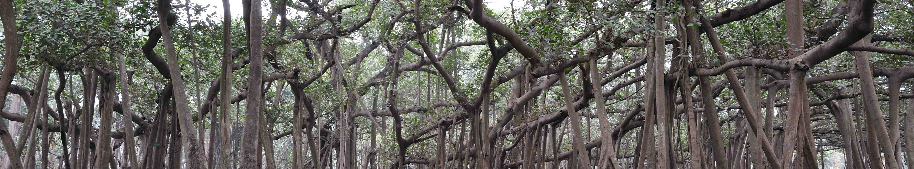

Banyan is tree specy germinating and growing over another tree, or over itself forming a odd shaped forest.

It is also a scala implementation of:

- decision trees
- gradient boosted forest
- random forest tree

For the moment only regression trees (without prunning) are implemented as well as gradient boosting.

The main advantages of banyan is:
- you can learn on continuous features as well a categorical data
- good handling of missing data (todo)
- feature importance (todo)

## Getting started

Once you cloned the project, you can use sbt to run some examples:

```
======== Housing example =========
Loading data:
Errors during parsing: 0
Start learning
Model fitted in 1266 ms
Pearson: 0.9408803964292091
RSquared: 0.8678479681107549
Rmse: 3.6777284826408727
```

I took inspiration from an existing project https://github.com/noneshallpass/Gradient-Boosted-Tree